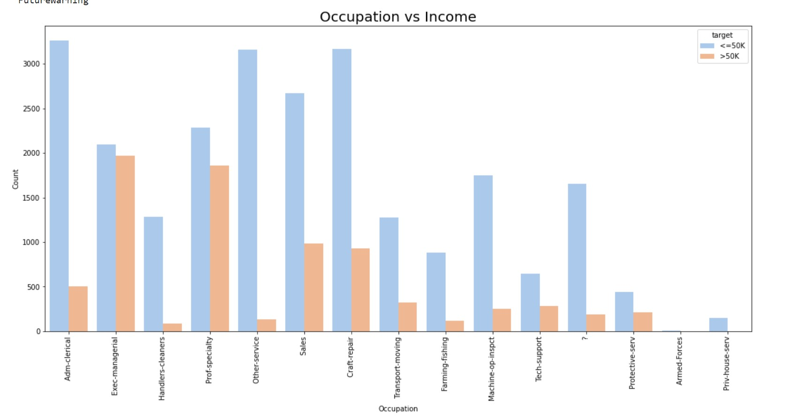
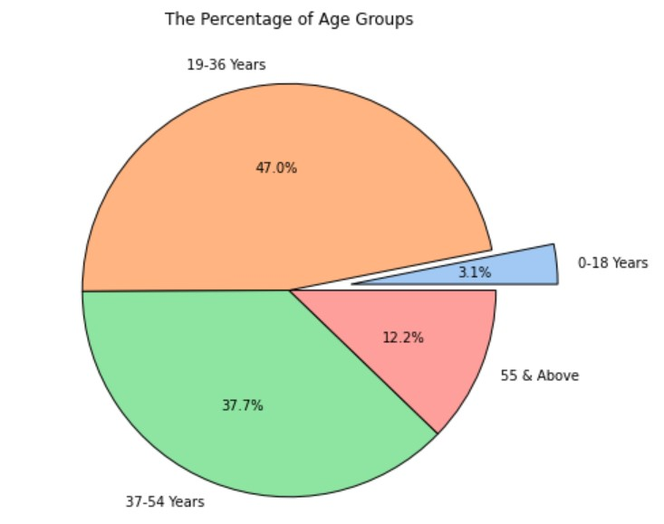
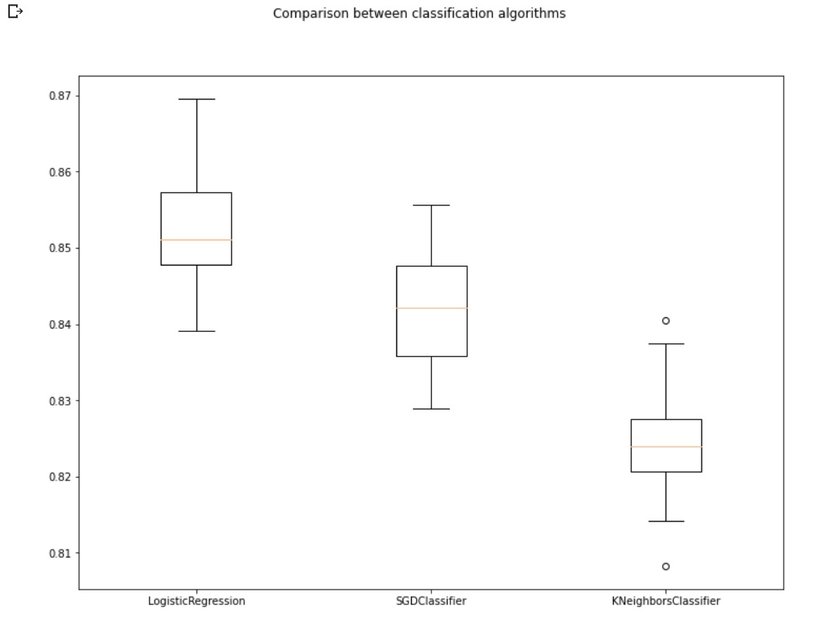

# Predict-customer-retention-ML using SGDClassifier, KNeighborsRegressor, and LogisticRegression
<li><a href="#Installation">Installation</a></li>
<li><a href="#Project Motivation">Project Motivation</a></li>
<li><a href="#EDA">File Descriptions</a></li>
<li><a href="#Results">Results</a></li>
<li><a href="#Licensing, Authors, and Acknowledgements">Licensing, Authors, and Acknowledgements</a></li>

# Installation:
Python versions 3.*.

- Libraries:
- Pandas.
- Scikit-learn.
- numpy.
- matplotlib.
- seaborn.

# Project Motivation:
In this project, We will use Machine learning models such as  `SGDClassifier`, `KNeighborsRegressor`, and `LogisticRegression` to make a prediction to determine whether a person makes over 50K a year.

# EDA:

- Males have more Better educations degrees.
- The occupation was very high for the rating **<=50K**, as it ranged between the two values **3000** to less than **500** .
- Most of the ages range from the age group of **19 to 36** years and the lowest are those with the age group less than **19 years**.
- Generally, people can be seen working for **30 hours to 40 hours per week** for the private work class.
- Most of the relationships shown were **Not-in-family** and the fewest were **Other-relative by 3%**.

# Results:

To conclude, we obtain `KNeighborsClassifier`, `LogisticRegression` `SGDClassifier` recorded accuracy with `83.0%`, `85.03%`, and `84.52%` respectively after using **GridSearchCV** and **RandomizedSearchCV**. As we have seen above with no significant difference among them.

To compare these models with the Baseline, we illustrate that. Baseline showed the lowest accuracy with 75.97%.

From the previous chart, the Area Under Curve (AUC) for LogisticRegression model LR is showing the best choice rather than K-Nearest Neighbors algorithm KNN.

